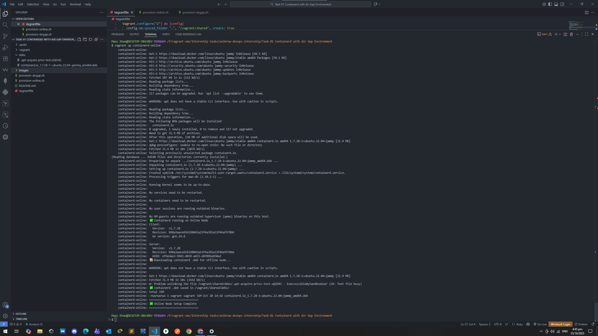
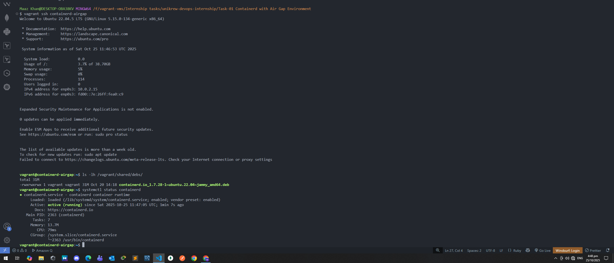

# 🚀 Task-01: Containerd with Air-Gap Environment (Binary Sync)

👨‍💻 **Internship Task — UniKrew DevOps Internship**

---

## 📘 Objective

To simulate a real-world **air-gapped container runtime setup** where the environment has no internet access, and binaries must be transferred manually from an online system.

This lab focuses purely on **Containerd** — installing it on an online node, downloading its `.deb` package, and using a shared folder to make that binary available for installation on an offline node.

---

## 🧱 Architecture Overview
```
+---------------------------------------------------------------+
|                    Vagrant Two-VM Environment                 |
+---------------------------------------------------------------+
|                                                               |
|  🌐 containerd-online (with internet)                         |
|     ├─ Installs containerd via apt (Docker repo)              |
|     ├─ Generates /vagrant/shared/debs/containerd.io*.deb      |
|                                                               |
|  ✈️ containerd-airgap (no internet)                            |
|     ├─ Reads .deb from /vagrant/shared/debs                   |
|     ├─ Installs and runs containerd offline                   |
|                                                               |
+---------------------------------------------------------------+
```
📁 **Shared Folder:** `/vagrant/shared/debs`


---

## 🧩 Vagrant Configuration

- Uses the **default VirtualBox shared folder** for file sync
- Each VM gets a **static IP**

| VM Name | IP | Purpose |
|----------|----|----------|
| containerd-online | 192.168.56.51 | Online node with internet |
| containerd-airgap | 192.168.56.52 | Offline node using local .deb |

**Snippet from Vagrantfile:**
```ruby
config.vm.synced_folder ".", "/vagrant/shared", create: true
```

---

## 🧰 Provisioning Flow

### 🌐 Online Node — `provision-online.sh`
- Installs containerd.io via apt
- Configures and starts the service
- Downloads the `.deb` package into `/vagrant/shared/debs/`

### ✈️ Air-Gap Node — `provision-airgap.sh`
- Detects the `.deb` in `/vagrant/shared/debs/`
- Installs containerd using `dpkg -i`
- Configures and enables containerd offline

---

## 🧪 Execution Steps

### 1️⃣ Start the Online Node
```bash
vagrant up containerd-online
```
✅ Installs containerd  
✅ Downloads `.deb` to `/vagrant/shared/debs/`

### 2️⃣ Verify Shared Folder
```bash
ls -lh shared/debs/
# Output:
# containerd.io_1.7.28-1_ubuntu.22.04_amd64.deb
```

### 3️⃣ Boot the Air-Gap Node
```bash
vagrant up containerd-airgap
```
✅ Installs containerd from shared `.deb`  
✅ Starts and verifies the service

### 4️⃣ Confirm Offline Installation
```bash
vagrant ssh containerd-airgap
systemctl status containerd
sudo ctr version
```
**Output:**
```
active (running)
Version: 1.7.28
```

---

## 📸 Sample Output Screens

| 🌐 Online Node | ✈️ Air-Gap Node |
|----------------|----------------|
|  |  |


---

## ⚙️ Verification Commands
| Command | Purpose |
|----------|----------|
| `ls -lh /vagrant/shared/debs/` | Confirm `.deb` presence |
| `sudo dpkg -l | grep containerd` | Verify installation |
| `sudo systemctl status containerd` | Check runtime service |
| `sudo ctr version` | Show containerd version |

---

## ✅ Result
| Node | Internet | Action | Result |
|------|-----------|---------|---------|
| 🌐 Online Node | ✅ | Installed and exported `.deb` | `/vagrant/shared/debs/containerd.io*.deb` ready |
| ✈️ Air-Gap Node | ❌ | Installed from local `.deb` | Containerd running offline ✅ |

---

## 🧠 Concept Recap

- **Online Node** → has internet → fetches binary
- **Shared Folder** → acts as transfer medium
- **Air-Gap Node** → uses the binary to install offline

This mirrors **real-world air-gap CI/CD setups** where production systems cannot reach the internet directly, ensuring security and controlled binary distribution.

