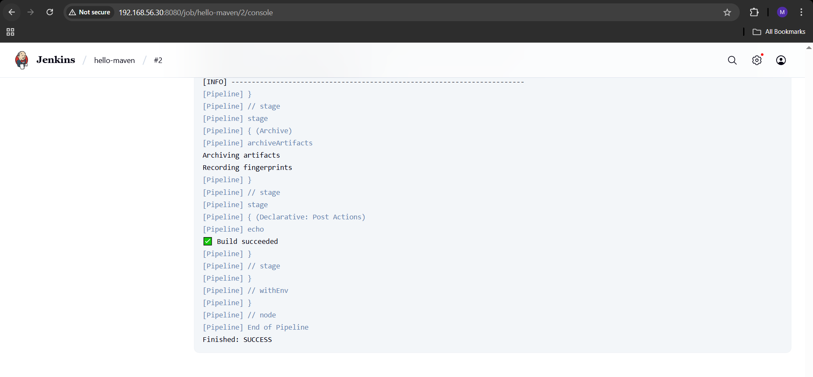
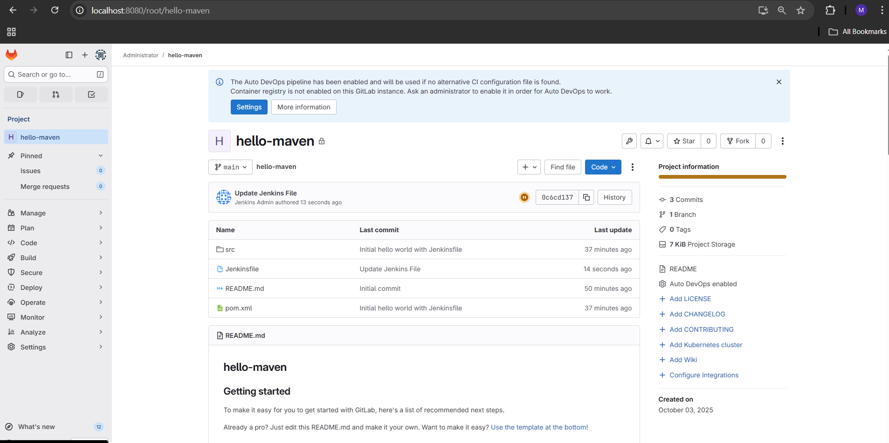

# 🚀 Task-02: Jenkins and GitLab Integration (Multi-VM CI/CD Setup)

👨‍💻 **Internship Task — UniKrew DevOps Internship**

---

## 📘 Objective

To set up a **multi-VM CI/CD environment** using Vagrant, where both **Jenkins** and **GitLab CE** run on separate Ubuntu servers.  
The goal was to integrate Jenkins with GitLab to automate the build and testing of a **sample Maven-based Java project**, replicating a **real-world enterprise CI/CD workflow**.

---

## 🧱 Architecture Overview
```
+-------------------------------------------------------------+
|                Vagrant Two-VM CI/CD Environment             |
+-------------------------------------------------------------+
|                                                             |
|  ⚙️  Jenkins-Server (192.168.56.11)                         |
|     ├─ Runs Jenkins CI/CD pipeline                          |
|     ├─ Pulls source from GitLab repo                        |
|     ├─ Builds and archives artifacts                        |
|                                                             |
|  🧰  GitLab-Server (192.168.56.12)                           |
|     ├─ Hosts 'hello-maven' repository                       |
|     ├─ Stores Jenkinsfile & project code                    |
|                                                             |
+-------------------------------------------------------------+
```
📁 **Network:** Private Network (192.168.56.0/24)

---

## 🧩 Vagrant Configuration

- Uses **Bento Ubuntu-22.04** base box
- Defines **two virtual machines** with separate provisioning scripts
- Shared provisioning logic kept in **common.sh**

| VM Name | IP | Purpose |
|----------|----|----------|
| jenkins | 192.168.56.11 | Jenkins CI/CD server |
| gitlab | 192.168.56.12 | GitLab CE server |

**Snippet from Vagrantfile:**
```ruby
config.vm.define "jenkins" do |jenkins|
  jenkins.vm.network "private_network", ip: "192.168.56.11"
  jenkins.vm.provision "shell", path: "scripts/jenkins.sh"
end

config.vm.define "gitlab" do |gitlab|
  gitlab.vm.network "private_network", ip: "192.168.56.12"
  gitlab.vm.provision "shell", path: "scripts/gitlab.sh"
end
```

---

## 🧰 Provisioning Flow

### ⚙️ Common Script — `common.sh`
- Updates base packages (`curl`, `git`, `wget`, `net-tools`)
- Ensures consistent environment for both VMs

### 🧩 Jenkins Script — `jenkins.sh`
- Installs **OpenJDK-17**
- Adds Jenkins repository & key
- Installs and starts Jenkins service
- Accessible at **http://192.168.56.11:8080**

### 🧱 GitLab Script — `gitlab.sh`
- Installs **GitLab CE** using the official package repo
- Configures external URL → **http://gitlab.local**
- Accessible at **http://192.168.56.12**

---

## 🧪 Execution Steps

### 1️⃣ Bring Up Jenkins Server
```bash
vagrant up jenkins
```
✅ Jenkins installed and running at [http://192.168.56.11:8080](http://192.168.56.11:8080)

### 2️⃣ Bring Up GitLab Server
```bash
vagrant up gitlab
```
✅ GitLab CE installed and accessible at [http://192.168.56.12](http://192.168.56.12)

### 3️⃣ Configure GitLab Repository
- Create project **hello-maven**
- Push **Maven project + Jenkinsfile**

### 4️⃣ Configure Jenkins Pipeline
- Create new **pipeline job**
- Under **SCM → Git**, add:
  ```
  http://192.168.56.12/root/hello-maven.git
  ```
- Add **GitLab credentials** (username + token)
- Choose **“Build now”** or enable **SCM polling** (webhook disabled due to restricted network)

---

## 📸 Sample Output Screens
| 🧩 Jenkins Pipeline Success | 🧱 GitLab Project View |
|-----------------------------|------------------------|
|  |  |

---

## ⚙️ Verification Commands
| Command | Purpose |
|----------|----------|
| `sudo systemctl status jenkins` | Verify Jenkins service |
| `sudo gitlab-ctl status` | Check GitLab services |
| `docker ps` *(if applicable)* | Verify build agents (optional) |

---

## ✅ Result
| Component | Role | Status | Output |
|------------|------|--------|---------|
| Jenkins | CI/CD Orchestrator | ✅ Running | Builds Maven project |
| GitLab | Source Control | ✅ Running | Hosts hello-maven repo |
| Integration | SCM via HTTP | ✅ Successful | Jenkins fetched and built repo |

---

## 🧠 Concept Recap

- **Vagrant + Shell Provisioning** → Automated multi-VM DevOps setup
- **Jenkins + GitLab** → Continuous Integration pipeline
- **SCM Polling** → Build automation without manual upload
- **Artifact Management** → Build and archive `.war` files

This setup simulates an **isolated enterprise CI/CD environment**, integrating core DevOps tools for automated build workflows.

---

## 📚 Key Learnings

- Installing and configuring Jenkins & GitLab CE on separate VMs
- Integrating SCM (GitLab) with Jenkins for pipeline builds
- Understanding **multi-VM orchestration** with Vagrant
- Troubleshooting services and network dependencies
- Gaining **real-world exposure** to CI/CD lifecycle and automation

---

## 🧾 Notes

- Webhook integration was disabled due to restricted network policies.
- Builds were triggered manually to validate end-to-end Jenkins pipeline execution.

