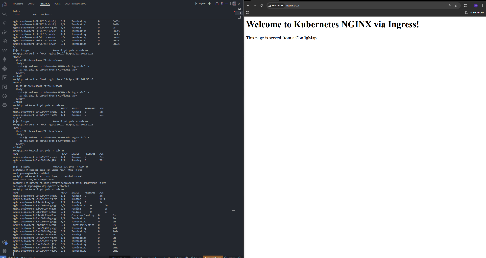

# 🚀 Task-03 — Kubernetes 2-Node Cluster + NGINX + Ingress (Domain-Based Routing)

👨‍💻 **Internship Project — UniKrew DevOps Labs**

This lab automates a full Kubernetes cluster setup (control plane + worker) using Vagrant, deploys an NGINX web app with a ConfigMap-based HTML page, and publishes it via an Ingress Controller with a custom domain **nginx.local**.

---

## 🧠 Objectives

- Create a 2-Node Kubernetes Cluster via Vagrant (Ubuntu 22.04)
- Install containerd, kubeadm, kubectl, and kubelet
- Deploy Calico CNI for pod networking
- Deploy a sample NGINX app with a ConfigMap-mounted HTML page
- Expose it via Ingress + domain routing (nginx.local)
- Automate all steps using provisioning scripts

---

## 🧱 Architecture Overview
```
+---------------------------------------------------------------+
|                   Kubernetes (Vagrant Lab)                    |
+---------------------------------------------------------------+
|                                                               |
|  🖥️ cp1 (Control Plane) — 192.168.56.10                       |
|     ├─ kube-apiserver / etcd / scheduler / controller-manager |
|     ├─ containerd + kubelet + kubectl                         |
|     ├─ Calico (CNI)                                           |
|     ├─ NGINX Ingress Controller                               |
|     ├─ NGINX App Pods (web ns)                                |
|                                                               |
|  🧩 w1 (Worker) — 192.168.56.11                               |
|     ├─ kubelet + containerd                                   |
|     ├─ Runs NGINX Pods managed by Deployment                  |
|                                                               |
+---------------------------------------------------------------+
```
🌍 **Browser → nginx.local → Ingress → Service → NGINX Pods**

---

## 🧰 Tools & Versions
| Tool | Version | Purpose |
|------|----------|----------|
| OS | Ubuntu 22.04 (Jammy) | Base VMs |
| Kubernetes | v1.30.x | Cluster |
| Containerd | 1.7.x | Runtime |
| CNI | Calico | Pod Networking |
| Ingress | NGINX | Domain Routing |
| Vagrant + VirtualBox | latest | Environment Automation |

---

## ⚙️ Environment Setup (Manual Flow)

### 1️⃣ Create & Boot VMs
```bash
vagrant up
vagrant status
```

### 2️⃣ SSH Access
```bash
vagrant ssh cp1
vagrant ssh w1
```

---

## 🧩 System Preparation (on both cp1 & w1)
```bash
sudo swapoff -a
sudo sed -i '/swap/d' /etc/fstab

cat <<EOF | sudo tee /etc/modules-load.d/k8s.conf
overlay
br_netfilter
EOF
sudo modprobe overlay
sudo modprobe br_netfilter

cat <<EOF | sudo tee /etc/sysctl.d/k8s.conf
net.bridge.bridge-nf-call-iptables  = 1
net.bridge.bridge-nf-call-ip6tables = 1
net.ipv4.ip_forward                 = 1
EOF
sudo sysctl --system
```

---

## 🐳 Install Container Runtime (containerd)
```bash
sudo apt update -y
sudo apt install -y containerd
sudo mkdir -p /etc/containerd
sudo containerd config default | sudo tee /etc/containerd/config.toml >/dev/null
sudo sed -i 's/SystemdCgroup = false/SystemdCgroup = true/' /etc/containerd/config.toml
sudo systemctl restart containerd
sudo systemctl enable containerd
```

---

## ☸️ Install Kubernetes Components
```bash
sudo apt-get update
sudo apt-get install -y apt-transport-https ca-certificates curl gpg
sudo mkdir -p /etc/apt/keyrings
curl -fsSL https://pkgs.k8s.io/core:/stable:/v1.30/deb/Release.key \
 | sudo gpg --dearmor -o /etc/apt/keyrings/kubernetes-apt-keyring.gpg

echo "deb [signed-by=/etc/apt/keyrings/kubernetes-apt-keyring.gpg] \
https://pkgs.k8s.io/core:/stable:/v1.30/deb/ /" | \
sudo tee /etc/apt/sources.list.d/kubernetes.list

sudo apt-get update
sudo apt-get install -y kubelet kubeadm kubectl
sudo apt-mark hold kubelet kubeadm kubectl
```

---

## 🧱 Initialize the Control Plane (cp1)
```bash
sudo kubeadm init \
  --apiserver-advertise-address=192.168.56.10 \
  --pod-network-cidr=192.168.0.0/16 \
  --cri-socket=unix:///var/run/containerd/containerd.sock
```
Copy the join command printed at the end.

### ⚙️ Configure kubectl (on cp1)
```bash
mkdir -p $HOME/.kube
sudo cp /etc/kubernetes/admin.conf $HOME/.kube/config
sudo chown $(id -u):$(id -g) $HOME/.kube/config
kubectl get nodes
```

---

## 🕸️ Install Calico CNI
```bash
kubectl apply -f https://raw.githubusercontent.com/projectcalico/calico/v3.27.2/manifests/calico.yaml
kubectl get pods -n kube-system
```

---

## 🧩 Join the Worker Node (w1)
```bash
sudo kubeadm join 192.168.56.10:6443 --token <token> \
  --discovery-token-ca-cert-hash sha256:<hash>
```
✅ Check from cp1:
```bash
kubectl get nodes
```
Both nodes should show **Ready**.

---

## 🌐 Deploy NGINX App + Ingress

### Create Namespace
```bash
kubectl create namespace web
```

### ConfigMap (HTML Page)
```bash
cat <<EOF | kubectl apply -f -
apiVersion: v1
kind: ConfigMap
metadata:
  name: nginx-html
  namespace: web
data:
  index.html: |
    <!DOCTYPE html>
    <html lang="en">
      <head><title>Welcome</title></head>
      <body>
        <h1>🚀 Welcome to Kubernetes NGINX via Ingress!</h1>
      </body>
    </html>
EOF
```

### Deployment
```bash
kubectl apply -f - <<EOF
apiVersion: apps/v1
kind: Deployment
metadata:
  name: nginx-deployment
  namespace: web
spec:
  replicas: 2
  selector:
    matchLabels:
      app: nginx
  template:
    metadata:
      labels:
        app: nginx
    spec:
      containers:
      - name: nginx
        image: nginx:latest
        ports:
        - containerPort: 80
        volumeMounts:
        - name: nginx-html
          mountPath: /usr/share/nginx/html
      volumes:
      - name: nginx-html
        configMap:
          name: nginx-html
EOF
```

### Service
```bash
kubectl expose deployment nginx-deployment \
  --type=ClusterIP --port=80 --target-port=80 -n web
```

---

## 🌉 Install NGINX Ingress Controller
```bash
kubectl apply -f https://raw.githubusercontent.com/kubernetes/ingress-nginx/main/deploy/static/provider/baremetal/deploy.yaml
kubectl get pods -n ingress-nginx
```
Wait until controller → **1/1 Running**

---

## 🌍 Create Ingress Rule
```bash
cat <<EOF | kubectl apply -f -
apiVersion: networking.k8s.io/v1
kind: Ingress
metadata:
  name: nginx-ingress
  namespace: web
spec:
  ingressClassName: nginx
  rules:
  - host: nginx.local
    http:
      paths:
      - path: /
        pathType: Prefix
        backend:
          service:
            name: nginx-deployment
            port:
              number: 80
EOF
```

### 🖥️ Update Host File
On your host machine:
```
192.168.56.10   nginx.local
```

### 🧪 Test Access
From cp1:
```bash
curl -H "Host: nginx.local" http://192.168.56.10
```
Browser:
```
http://nginx.local
```
✅ Output:
> 🚀 Welcome to Kubernetes NGINX via Ingress!

---

## ✅ Verification Commands
```bash
kubectl get nodes
kubectl get pods -A
kubectl get svc -A
kubectl get ingress -A
```
All pods should be **Running**, and Ingress should show an address bound to **192.168.56.10**.

---

## 📸 Sample Output Screen

| 🧩 Kubernetes Output + Browser View |
|------------------------------------|
|  |

---

## 🧾 Summary
| Layer | Component | Description |
|--------|------------|-------------|
| Infrastructure | Vagrant + VirtualBox | Creates VMs |
| Runtime | containerd | Runs containers |
| Control Plane | kubeadm | Initializes cluster |
| Network | Calico CNI | Pod Networking |
| Workload | NGINX | Static web app |
| Access | Ingress Controller | Domain Routing |
| Config | ConfigMap | Custom HTML page |

