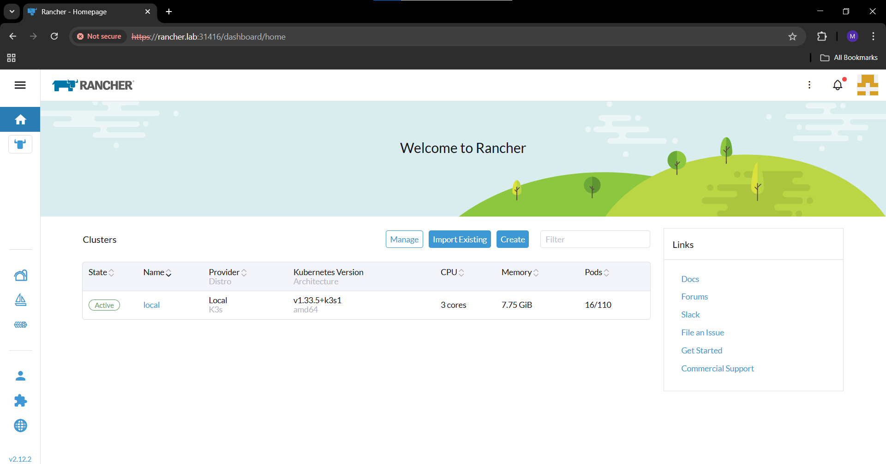

# 🚀 Task-04 — Rancher + K3s Cluster + Kong Gateway Integration

👨‍💻 **Internship Project — UniKrew DevOps Labs**

This task automates a multi-node Kubernetes cluster with Rancher as the management layer and integrates an external Kong API Gateway (DB-less) running as a dedicated VM.

It demonstrates full-stack orchestration — from cluster provisioning to API gateway management and service routing.

---

## 🧠 Objectives

- Deploy a 3-Node K3s Cluster (1 Master + 2 Workers) via Vagrant
- Install and configure Rancher (TLS + private CA)
- Configure Local Docker Registry + NFS Storage Provisioner
- Install Traefik Ingress with NodePort exposure
- Provision an external Kong Gateway VM connected to Rancher
- Expose Rancher UI through Kong proxy (/rancher route)
- Implement internal DNS connectivity across all VMs

---

## 🧱 Architecture Overview

### 🖼️ Official Rancher Architecture
*(Explains internal Rancher server components — API server, controllers, agents, and downstream clusters.)*


---

### 🧩 Project Infrastructure Diagram
*(Depicts the Vagrant-based multi-VM setup used in this internship project.)*


---

## 🧩 VM Layout
| VM Name | Role | IP Address | Components |
|----------|------|-------------|-------------|
| rancher-master | Control Plane + Rancher UI | 192.168.56.10 | K3s Server + Rancher + Traefik Ingress |
| worker1 | K3s Worker Node | 192.168.56.11 | kubelet + containerd |
| worker2 | K3s Worker Node | 192.168.56.12 | kubelet + containerd |
| kong-gateway | API Gateway VM | 192.168.56.15 | Docker + Kong 3.4 (DB-less) |

---

## 🖥️ Sample Outputs

### 🧰 Rancher Setup — Login Screen


### ✅ Rancher Dashboard — Cluster Overview


### 🧩 Nodes View — Master + Workers


### 🌐 Kong Manager UI — Running on Port 8002


### ⚙️ Kong Admin API — Port 8001


---

## 🚀 Step-By-Step Deployment

### 1️⃣ Bring up the Rancher Cluster
```bash
vagrant up rancher-master
vagrant up worker1
vagrant up worker2
```
Each VM runs `common.sh` → base setup, then provisions with its respective script.

Check cluster status:
```bash
vagrant ssh rancher-master
kubectl get nodes
```

### 2️⃣ Access Rancher UI
- **URL:** https://rancher.local
- **Username:** admin  
- **Password:** admin  

📌 Add host entry:
```
192.168.56.10 rancher.local
```

### 3️⃣ Deploy the Kong Gateway VM
```bash
vagrant up kong-gateway
```

#### Access after provisioning:
| Service | URL | Description |
|----------|-----|-------------|
| Kong Manager UI | http://192.168.56.15:8002 | Web Dashboard |
| Kong Admin API | http://192.168.56.15:8001 | REST API |
| Kong Proxy | http://192.168.56.15:8000 | API Gateway Proxy |
| Rancher Route | http://192.168.56.15:8000/rancher | Proxies Rancher UI through Kong |

### 4️⃣ Verify Internal DNS Connectivity
All VMs have `/etc/hosts` entries:
```
192.168.56.10 rancher-master rancher.local
192.168.56.11 worker1
192.168.56.12 worker2
192.168.56.15 kong-gateway kong.local
```
Ping check from Kong VM:
```bash
ping -c 3 rancher-master
curl http://rancher-master:30443 -k
```

---

## 📜 Automation Summary
| Script | Purpose |
|---------|----------|
| common.sh | Base system setup + DNS config for all VMs |
| setup_master.sh | Rancher + K3s control plane + NFS storage + Traefik |
| setup_worker.sh | Joins workers to K3s cluster via shared token |
| setup_kong_vm.sh | Installs Docker + Kong Gateway (DB-less) + Rancher route (/rancher) |

---

## 🧪 Validation Commands
```bash
# On rancher-master
kubectl get pods -A
kubectl get svc -A

# On kong-gateway
docker ps
curl -i http://localhost:8001
curl -i http://localhost:8000/rancher
```

---

## 🧭 Outputs
| Component | Verification |
|------------|---------------|
| Rancher UI | Accessible at https://rancher.local |
| Kong Manager | Accessible at http://192.168.56.15:8002 |
| Route Proxy | curl http://192.168.56.15:8000/rancher → Rancher response |
| K3s Cluster | kubectl get nodes shows 3 nodes Ready |

---

## 🧠 Key Concepts Learned
| Area | Concepts |
|------|-----------|
| Kubernetes Mgmt | Rancher Architecture, Traefik Ingress, TLS |
| Storage Mgmt | NFS Provisioner, PersistentVolume automation |
| Container Registry | Local insecure Docker Registry proxy |
| Networking | Vagrant private network, DNS inter-VM resolution |
| API Gateway | Kong DB-less config, Admin API, Proxy routing |

---
