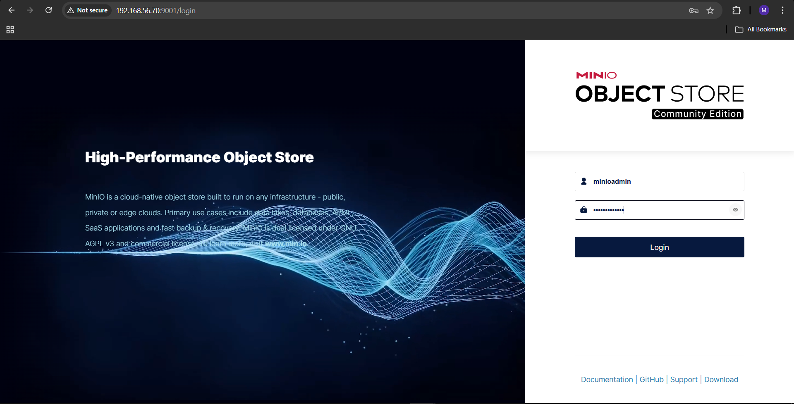
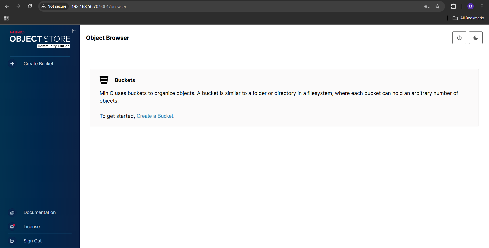

# 🚀 Task-05 — Standalone MinIO Object Storage Setup

👨‍💻 **Internship Project — UniKrew DevOps Labs**

This lab automates a complete MinIO object storage setup using Vagrant and shell provisioning. It provides a self-hosted, S3-compatible storage environment for backups, artifacts, and DevOps integrations such as Jenkins, Rancher, and Kong.

---

## 🧠 Objectives

- Create a standalone MinIO VM using Vagrant (Ubuntu 22.04)
- Automate installation of MinIO Server and Client (mc)
- Configure persistent storage and environment variables
- Access the MinIO Web Console (port 9001)
- Create and verify a test bucket (devops-lab)
- Prepare the setup for future integration with Rancher and Kong

---

## 🧱 Architecture Overview

```
+---------------------------------------------------------------+
|                      Standalone MinIO VM                      |
+---------------------------------------------------------------+
| Box: Ubuntu 22.04 (bento/ubuntu-22.04)                        |
| Hostname: minio-node                                          |
| Private IP: 192.168.56.70                                     |
|---------------------------------------------------------------|
| Services:                                                     |
|   • MinIO Server (port 9000) — S3 API endpoint                |
|   • MinIO Console (port 9001) — Web UI                        |
|---------------------------------------------------------------|
| Storage:                                                      |
|   /mnt/data  ->  Persistent bucket data                       |
| Config:                                                       |
|   /opt/config/minio.env  ->  Credentials and volumes           |
| Scripts:                                                      |
|   common.sh + minio.sh  ->  Automated provisioning             |
+---------------------------------------------------------------+
```

---

## ⚙️ Environment Configuration (`config/minio.env`)

```
MINIO_ROOT_USER=minioadmin
MINIO_ROOT_PASSWORD=minioadmin123
MINIO_VOLUMES="/mnt/data"
```

---

## 🌀 Provisioning Flow

1️⃣ 🧰 **common.sh** — Updates system, installs base packages  
2️⃣ ⚙️ **minio.sh** — Installs and configures MinIO server + client  
3️⃣ 🔗 **alias.json** — Adds preconfigured `mc` alias  
4️⃣ 📦 Auto-creates a test bucket (**devops-lab**) and uploads a sample file

---

## 💻 Access Details

| Component          | URL / Command             | Description               |
| ------------------ | ------------------------- | ------------------------- |
| 🌐 Web Console     | http://192.168.56.70:9001 | MinIO UI access           |
| 🔌 S3 API Endpoint | http://192.168.56.70:9000 | REST API for integrations |
| 🧑‍💻 Access Key      | minioadmin                | Login username            |
| 🔒 Secret Key      | minioadmin123             | Login password            |

---

## 🧰 Verification Commands (inside VM)

```bash
vagrant ssh minio-node
mc alias list
mc ls local
mc ls local/devops-lab
```

### ✅ Expected Output

```
[2025-10-26 21:15:01 UTC]  34B sample.txt
```

---

## 📸 Sample Output Screens

| 🧩 MinIO Login               | 🗑️ Bucket View                 |
| ---------------------------- | ------------------------------ |
|  |  |
