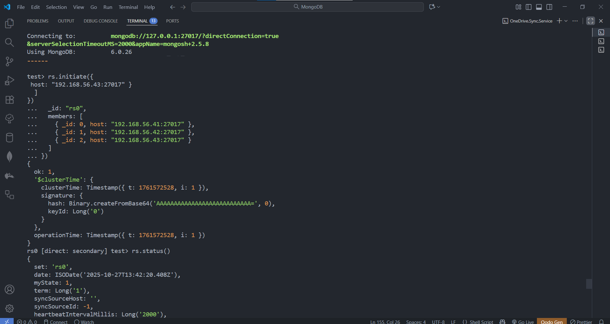

# 🚀 Task-05: MongoDB Hybrid Air-Gap + Replica Set Setup (Auth + KeyFile)

---

## 👨‍💻 Internship Context
This task is part of the **UniKrew DevOps Internship Series**, continuing from our previous labs (Rancher → Kong → MinIO → Containerd).  
Here, we focus on deploying **MongoDB** — first as a **single-node Air-Gapped installation**, and then scaling to a **3-Node Replica Set** with authentication and secure key-based internal communication.

---

## 📘 Objective
To install and configure **MongoDB 6.0** in two phases:
1. **Standalone (Air-Gap Mode)** — learn offline package handling and configuration.
2. **Replica Set (3 Nodes)** — achieve high availability, fault-tolerance, and internal authentication using a shared keyFile.

---

## 🧩 Vagrant Configuration
| VM Name | IP Address | Role |  
|----------|------------|------|  
| **mongo-1** | 192.168.56.41 | Primary Replica + Admin Node |  
| **mongo-2** | 192.168.56.42 | Secondary Replica |  
| **mongo-3** | 192.168.56.43 | Secondary Replica |  

Each VM provisions MongoDB via the same shell script, with `/vagrant/sync` used to share downloaded `.deb` packages and the `mongodb-keyfile` for air-gap and replica synchronization.

---

## ⚙️ Provisioning Flow
### Phase 1 — Single Node MongoDB (Air-Gap Mode)
1. Download `.deb` packages online.
2. Copy them to `/opt/sync/` for reuse.
3. Disconnect network (Air-Gap).
4. Install packages locally and start `mongod`.
5. Validate service and test CRUD operations.

### Phase 2 — Three Node Replica Set (Hybrid Mode)
1. Install MongoDB on all three nodes.
2. Append replication config to `/etc/mongod.conf`.
3. Generate and share keyFile between nodes.
4. Enable `authorization: enabled`.
5. Initialize replica set from primary.
6. Create admin user and verify authentication.

---

## 🧪 Execution Steps (Summary)

### Step 1 — SSH into each VM
```bash
vagrant ssh mongo-1
vagrant ssh mongo-2
vagrant ssh mongo-3
```

### Step 2 — Verify Replication Block
```bash
sudo nano /etc/mongod.conf
```
Ensure the file ends with:
```yaml
replication:
  replSetName: rs0
```
Then restart:
```bash
sudo systemctl restart mongod
sudo systemctl status mongod
```

### Step 3 — Initialize Replica Set (on mongo-1)
```bash
mongosh
rs.initiate({
  _id: "rs0",
  members: [
    { _id: 0, host: "192.168.56.41:27017" },
    { _id: 1, host: "192.168.56.42:27017" },
    { _id: 2, host: "192.168.56.43:27017" }
  ]
})
```
✅ Expect: `{ "ok" : 1 }`

### Step 4 — Create Admin User (on mongo-1)
```js
use admin
db.createUser({
  user: "admin",
  pwd: "Admin@123",
  roles: [ { role: "root", db: "admin" } ]
})
```

### Step 5 — Verify Authentication
```bash
exit
mongosh -u admin -p Admin@123 --authenticationDatabase admin
```
✅ Successful login shows `rs0 [direct: primary] admin>`

### Step 6 — Check Replica Status
```js
rs.status()
```

---

## 📸 Sample Output Screens

### 🧩 Single Node MongoDB (Air-Gap Setup)
| Step | Description | Screenshot |
|------|--------------|-------------|
| 1️⃣ | MongoDB `.deb` packages installed successfully |  |
| 2️⃣ | Verified configuration (`/etc/mongod.conf`) |  |
| 3️⃣ | Inserted test data |  |
| 4️⃣ | Validated collection and find operation |  |
| ✅ | Final confirmation — “MongoDB Hybrid Airgap Setup Completed” |  |

---

### 🧱 Three Node Replica Set (Air-Gap + Auth)
| Step | Description | Screenshot |
|------|--------------|-------------|
| 1️⃣ | Provisioned 3 MongoDB nodes |  |
| 2️⃣ | Replication block added to `/etc/mongod.conf` |  |
| 3️⃣ | KeyFile and auth enabled successfully |  |
| 4️⃣ | Replica set initiated (`rs.initiate`) |  |
| 5️⃣ | `rs.status()` showing PRIMARY/SECONDARY states |  |
| 6️⃣ | Admin login verified |  |
| 7️⃣ | Mongo-2 became PRIMARY after failover |  |
| ✅ | All nodes synchronized and healthy |  |

---

## 🧠 Concept Recap

| Area | Key Learning |
|------|---------------|
| Air-Gap Install | Offline APT installation using local `.deb` packages. |
| Replication | Replica set structure: PRIMARY + SECONDARY nodes sharing same `replSetName`. |
| KeyFile Auth | Internal node-to-node trust for authenticated replication. |
| Admin Auth | User must exist before enabling authorization. |
| YAML Order | Replication → Security order in `mongod.conf` is critical. |
| Orchestration | Provisioning ≠ Orchestration — use Ansible to coordinate multi-VM timing. |

---

✅ **Final Result:**  
A fully authenticated 3-node MongoDB replica set running in hybrid Air-Gap mode,  
deployed and tested across multiple VMs using Vagrant, with replication, authentication, and fail-over verified successfully.
