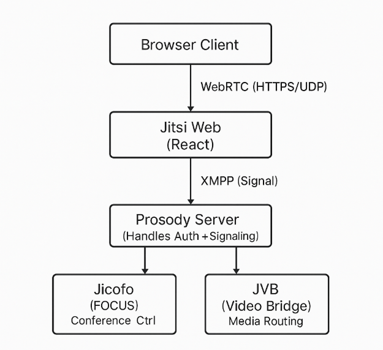
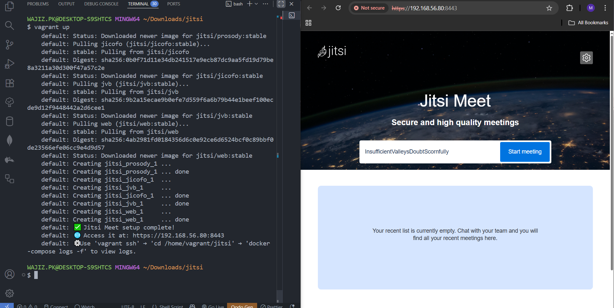
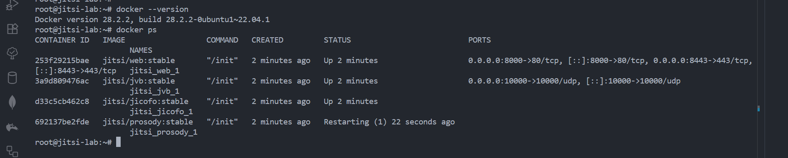
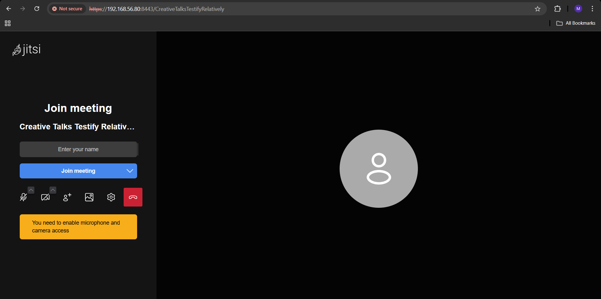

# 🚀 Task-07 — Jitsi Meet (Dockerized Lab)

👨‍💻 **Internship Context**

This task is part of the **UniKrew DevOps Internship Series**, following earlier labs on **Containerd**, **Jenkins-GitLab**, **Kubernetes**, **Rancher**, **MinIO**, and **MongoDB**.  
In this lab, the focus is on **containerized collaboration systems** — deploying and managing **Jitsi Meet**, an open-source video conferencing platform, through complete automation.

---

## 📘 Objective
To deploy a **self-hosted Jitsi Meet** setup inside a **Vagrant-provisioned Ubuntu VM**, using **Docker Compose** for orchestration.  
The goal is to understand how **multi-container communication**, **real-time media routing**, and **DevOps automation** come together to simulate an enterprise-grade conferencing platform.

---
## 🏗️ Architecture Diagram

The following diagram illustrates how different components of **Jitsi Meet** interact within the Dockerized environment.



---

## 🧩 Vagrant Configuration
| VM Name | IP Address | Role |
|----------|-------------|------|
| jitsi-vm | 192.168.56.80 | Jitsi Meet Stack Host |

**Base OS:** Ubuntu 22.04 (Jammy)  
**Provisioner:** Bash (`provision.sh`)  
**Network:** Private IP → 192.168.56.80  
**Ports:** 8443 (HTTPS) • 10000/udp (Video Bridge)

---

## ⚙️ Provisioning Flow
### 🧱 Phase 1 — VM Automation
- `Vagrantfile` provisions the VM and triggers the provisioning script.
- Script installs **Docker** and **Docker Compose**.
- **Systemd** enables and starts Docker service.

### 🚀 Phase 2 — Jitsi Stack Setup
- Create a `jitsi/` directory containing `.env` and `docker-compose.yml`.
- Generate environment variables dynamically:
```
HTTP_PORT=8000
HTTPS_PORT=8443
PUBLIC_URL=https://192.168.56.80
ENABLE_GUESTS=1
```

- Launch the stack:
```bash
docker-compose up -d
```

- Verify running containers:
```bash
docker ps
```
✅ Expect: `web`, `prosody`, `jicofo`, `jvb`

---

## 🧪 Execution Steps (Summary)
| Step | Description | Command / Action |
|------|--------------|------------------|
| 1️⃣ | Initialize Environment | `vagrant up` |
| 2️⃣ | Verify Container Stack | `vagrant ssh` → `docker ps` |
| 3️⃣ | Access Web UI | Open browser → 🔗 https://192.168.56.80:8443 |
| 4️⃣ | Check Logs | `docker-compose logs -f prosody` / `docker-compose logs -f jvb` |

---

## 📸 Sample Output Screens
| Step | Description | Screenshot |
|------|--------------|-------------|
| 1️⃣ | Provisioning and Docker setup completed |  |
| 2️⃣ | Jitsi Meet Home UI Accessible |  |
| 3️⃣ | Meeting Interface Active |  |

---

## 🧠 Concept Recap
| Area | Key Learning |
|-------|--------------|
| Containerization | Real-world multi-container orchestration with Docker Compose |
| Provisioning | Automated VM setup via Vagrant + Bash |
| Networking | Internal Docker bridge network with private IP |
| Media Flow | Signaling (XMPP) vs Media Transport (RTP/UDP) |
| DevSecOps | Secure self-hosted video service deployment |

---

## ✅ Final Result
A **fully automated Dockerized Jitsi Meet instance** deployed through Vagrant, integrating **Prosody**, **Jicofo**, **JVB**, and **Web UI** components in a single private environment — demonstrating **orchestration**, **networking**, and **secure DevOps deployment**.