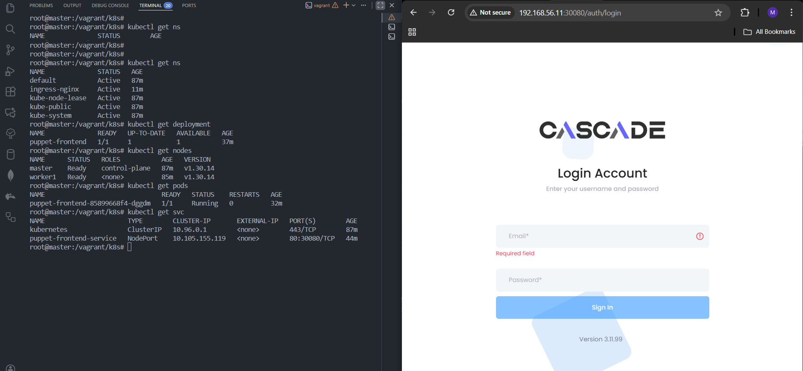
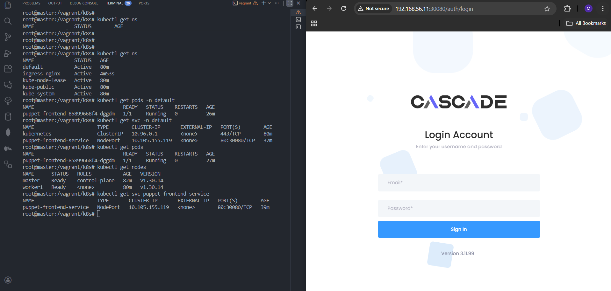

# 🚀 **Task-08 — Puppet Frontend Deployment on Kubernetes (Vagrant + Containerd)**

## 🎓 **UniKrew DevOps Internship — Hands-on Kubernetes Lab**

This task focuses on deploying the Puppet Frontend application inside a multi-node Kubernetes cluster built using Vagrant + VirtualBox.
With a single vagrant up, both the master and worker nodes are provisioned, Kubernetes is configured, and the cluster becomes ready for workloads.
---

## 🎯 **1. Objectives**

- Automate Kubernetes master + worker provisioning using Vagrant
- Install and configure containerd, kubeadm, kubelet, kubectl
- Set up Calico CNI for cluster networking
- Import Puppet Docker image into containerd
- Deploy application using Deployment + NodePort
- Access application externally via host machine

---

## 🏗️ **2. Architecture Overview**

```
+---------------- Host Machine (Windows) ----------------+
|                                                        |
|   Access Application At:  http://192.168.56.11:30080   |
|                                                        |
+-----------------------+--------------------------------+
                        |
       (Host-Only Network: 192.168.56.0/24)
                        |
+--------------------------------------------------------+
|                  Vagrant VirtualBox Cluster            |
|                                                        |
|   +------------------+       +---------------------+   |
|   | Master Node      |       | Worker Node         |   |
|   | 192.168.56.10    |       | 192.168.56.11       |   |
|   | Control-Plane    |       | Runs Puppet App     |   |
|   | containerd / k8s |       | containerd / k8s    |   |
|   +------------------+       +---------------------+   |
|                   Kubernetes Cluster                   |
+--------------------------------------------------------+

```

---

## 🖥️ **3. Automated VM Layout (Vagrant)**

### 🧩 **Master Node Automation**

- Installs containerd, kubeadm, kubelet, kubectl
- Initializes Kubernetes control-plane
- Configures kubeconfig
- Generates join command → saved as `/vagrant/shared/join.sh`

### 🖧 **Worker Node Automation**

- Installs containerd and Kubernetes components
- Fetches `/vagrant/shared/join.sh`
- Automatically joins the cluster

**✔ Result:** A fully working multi-node cluster with a single command:

```
vagrant up

```

---

## 📦 **5. Import Puppet Image into Worker Node (containerd)**

Place image file inside:

```
/vagrant/shared/

```

Run on worker node:

```
cd /vagrant/shared
sudo ctr -n k8s.io images import puppet-frontend:mmbl-qa-36971.tar

```

Verify:

```
sudo ctr -n k8s.io images ls | grep puppet

```

---

## 🚀 **6. Apply Kubernetes Deployment**

### 📄 **deployment.yaml**

```
apiVersion: apps/v1
kind: Deployment
metadata:
  name: puppet-frontend
spec:
  replicas: 1
  selector:
    matchLabels:
      app: puppet-frontend
  template:
    metadata:
      labels:
        app: puppet-frontend
    spec:
      containers:
      - name: puppet-frontend
        image: unikrew.azurecr.io/puppet-frontend:mmbl-qa-36971
        ports:
        - containerPort: 80

```

Apply:

```
kubectl apply -f deployment.yaml
kubectl get pods -o wide

```

---

## 🌐 **7. Expose Application Using NodePort**

### 📄 **service.yaml**

```
apiVersion: v1
kind: Service
metadata:
  name: puppet-frontend-service
spec:
  type: NodePort
  selector:
    app: puppet-frontend
  ports:
    - port: 80
      targetPort: 80
      nodePort: 30080

```

Apply:

```
kubectl apply -f service.yaml
kubectl get svc puppet-frontend-service

```

Sample Output:

```
puppet-frontend-service   NodePort   10.x.x.x   <none>   80:30080/TCP

```

---

## 🔍 **8. Validation & Testing**

### 📡 **Cluster Verification**

```
kubectl get nodes
kubectl get pods -o wide
kubectl get svc puppet-frontend-service

```

### 🌍 **Access From Windows Browser**

```
http://192.168.56.11:30080

```

Expected: **Puppet login page should load successfully.**

---

## 🖼️ **9. Output Screenshots**

### 🖼️ Screenshot 1



### 🖼️ Screenshot 2



---

## 🎓 **10. Key Learnings**

- How Kubernetes works with containerd runtime
- Importing OCI images using containerd
- ClusterIP vs NodePort behavior in local clusters
- Vagrant automation for multi-node Kubernetes
- VirtualBox networking behavior
- Troubleshooting common Kubernetes access issues

---

## 🛠️ **11. Troubleshooting Notes**

- ❗ `ErrImageNeverPull` → image not imported on worker
- 🔧 NodePort required for external access in Vagrant
- 🔒 Host-only network accessible only from Windows, not VM
- 📌 Control-plane cannot curl NodePort (expected behavior)
